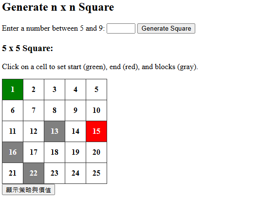
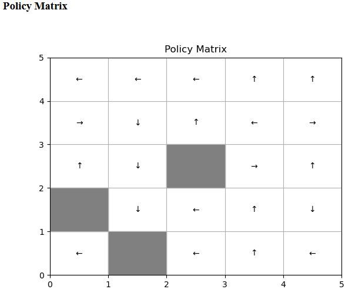

# Prompt  
  
# Chat GPT 結果  
HW1/  
│  
├── app.py                  # Flask 主程式  
├── templates/  
│   └── index.html          # 前端頁面  
└── static/  
    └── style.css           # CSS 樣式  
## style.css  
  
## index.html  
  
  
## app.py  
  
  
  
# 程式結果  
  
  
 